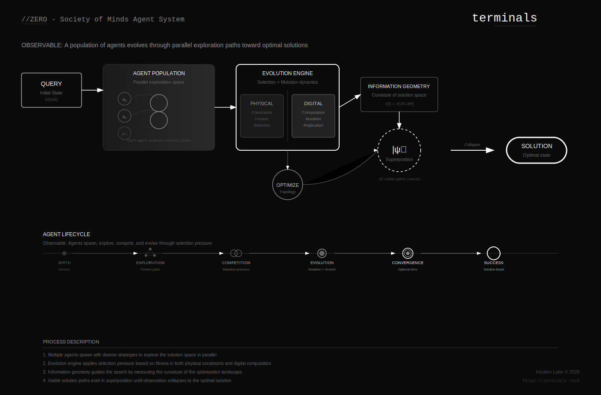

[](https://github.com/wheattoast11/openrouter-deep-research)
# OpenRouter Agents MCP Server

[MAJOR UPDATE – August 12, 2025] An intelligent MCP server that orchestrates GPT‑5 / Gemini / Claude agents to research in parallel, indexing as it goes (PGlite + vectors), then synthesizes consensus with strict, URL‑backed citations.

- Killer features
  - Plan → parallelize → synthesize workflow with bounded parallelism
  - Dynamic model catalog; supports Anthropic Sonnet‑4 and OpenAI GPT‑5 family
  - Built‑in semantic KB (PGlite + pgvector) with backup, export/import, health, and reindex tools
  - Lightweight web helpers: quick search and page fetch for context
  - Robust streaming (SSE), per‑connection auth, clean logs

## What’s new (v1.3)
- Local hybrid indexer (BM25 + optional vector rerank) with MCP tools: `index_texts`, `index_url`, `search_index`.
- Auto‑indexing during research: every saved report and fetched page can be indexed on the fly.
- Prompt/resource registration (MCP): `planning_prompt`, `synthesis_prompt`, and `mcp_spec_links`.
- Compact prompts option: minimize tokens while enforcing explicit URL citations and confidence scoring.
- Planning model fallbacks and simplified routing per strategy.

[Changelog →](docs/CHANGELOG.md)

## Quick start
1) Prereqs
- Node 18+ (20 LTS recommended), npm, Git, OpenRouter API key

2) Install
```bash
npm install
```

3) Configure (.env)
```dotenv
OPENROUTER_API_KEY=your_openrouter_key
SERVER_API_KEY=your_http_transport_key
SERVER_PORT=3002

# Modes (pick one; default ALL)
# AGENT  = agent-only + always-on ops (ping/status/jobs)
# MANUAL = individual tools + always-on ops
# ALL    = agent + individual tools + always-on ops
MODE=ALL

# Orchestration
ENSEMBLE_SIZE=2
PARALLELISM=4

# Models (override as needed) - Updated with state-of-the-art cost-effective models
PLANNING_MODEL=openai/gpt-5-chat
PLANNING_CANDIDATES=openai/gpt-5-chat,google/gemini-2.5-pro,anthropic/claude-sonnet-4
HIGH_COST_MODELS=x-ai/grok-4,openai/gpt-5-chat,google/gemini-2.5-pro,anthropic/claude-sonnet-4,morph/morph-v3-large
LOW_COST_MODELS=deepseek/deepseek-chat-v3.1,z-ai/glm-4.5v,qwen/qwen3-coder,openai/gpt-5-mini,google/gemini-2.5-flash
VERY_LOW_COST_MODELS=openai/gpt-5-nano,deepseek/deepseek-chat-v3.1

# Storage
PGLITE_DATA_DIR=./researchAgentDB
PGLITE_RELAXED_DURABILITY=true
REPORT_OUTPUT_PATH=./research_outputs/

# Indexer
INDEXER_ENABLED=true
INDEXER_AUTO_INDEX_REPORTS=true
INDEXER_AUTO_INDEX_FETCHED=true

# MCP features
MCP_ENABLE_PROMPTS=true
MCP_ENABLE_RESOURCES=true

# Prompt strategy
PROMPTS_COMPACT=true
PROMPTS_REQUIRE_URLS=true
PROMPTS_CONFIDENCE=true

```

4) Run
- STDIO (for Cursor/VS Code MCP):
```bash
node src/server/mcpServer.js --stdio
```
- HTTP/SSE (local daemon):
```bash
SERVER_API_KEY=$SERVER_API_KEY node src/server/mcpServer.js
```

### Windows PowerShell examples
- STDIO
```powershell
$env:OPENROUTER_API_KEY='your_key'
$env:INDEXER_ENABLED='true'
node src/server/mcpServer.js --stdio
```
- HTTP/SSE
```powershell
$env:OPENROUTER_API_KEY='your_key'
$env:SERVER_API_KEY='devkey'
$env:SERVER_PORT='3002'
node src/server/mcpServer.js
```

### One-liner demo scripts
Dev (HTTP/SSE):
```bash
SERVER_API_KEY=devkey INDEXER_ENABLED=true node src/server/mcpServer.js
```

STDIO (Cursor/VS Code):
```bash
OPENROUTER_API_KEY=your_key INDEXER_ENABLED=true node src/server/mcpServer.js --stdio
```

### MCP client JSON configuration (no manual start required)
You can register this server directly in MCP clients that support JSON server manifests.

Minimal examples:

1) STDIO transport (recommended for IDEs)
```json
{
  "servers": {
    "openrouter-agents": {
      "command": "npx",
      "args": ["@terminals-tech/openrouter-agents", "--stdio"],
      "env": {
        "OPENROUTER_API_KEY": "${OPENROUTER_API_KEY}",
        "SERVER_API_KEY": "${SERVER_API_KEY}",
        "PGLITE_DATA_DIR": "./researchAgentDB",
        "INDEXER_ENABLED": "true"
      }
    }
  }
}
```

2) HTTP/SSE transport (daemon mode)
```json
{
  "servers": {
    "openrouter-agents": {
      "url": "http://127.0.0.1:3002",
      "sse": "/sse",
      "messages": "/messages",
      "headers": {
        "Authorization": "Bearer ${SERVER_API_KEY}"
      }
    }
  }
}
```

With the package installed globally (or via npx), MCP clients can spawn the server automatically. See your client’s docs for where to place this JSON (e.g., `~/.config/client/mcp.json`).

## Tools (high‑value)
- Always‑on (all modes): `ping`, `get_server_status`, `job_status`, `get_job_status`, `cancel_job`
- AGENT: `agent` (single entrypoint for research / follow_up / retrieve / query)
- MANUAL/ALL toolset: `submit_research` (async), `conduct_research` (sync/stream), `research_follow_up`, `search` (hybrid), `retrieve` (index/sql), `query` (SELECT), `get_report_content`, `list_research_history`
- Jobs: `get_job_status`, `cancel_job`
- Retrieval: `search` (hybrid BM25+vector with optional LLM rerank), `retrieve` (index/sql wrapper)
- SQL: `query` (SELECT‑only, optional `explain`)
- Knowledge base: `get_past_research`, `list_research_history`, `get_report_content`
- DB ops: `backup_db` (tar.gz), `export_reports`, `import_reports`, `db_health`, `reindex_vectors`
- Models: `list_models`
- Web: `search_web`, `fetch_url`
- Indexer: `index_texts`, `index_url`, `search_index`, `index_status`

### Tool usage patterns (for LLMs)
Use `tool_patterns` resource to view JSON recipes describing effective chaining, e.g.:
- Search → Fetch → Research
- Async research: submit, stream via SSE `/jobs/:id/events`, then get report content

Notes
- Data lives locally under `PGLITE_DATA_DIR` (default `./researchAgentDB`). Backups are tarballs in `./backups`.
- Use `list_models` to discover current provider capabilities and ids.

## Architecture at a glance
See `docs/diagram-architecture.mmd` (Mermaid). Render to SVG with Mermaid CLI if installed:
```bash
npx @mermaid-js/mermaid-cli -i docs/diagram-architecture.mmd -o docs/diagram-architecture.svg
```
Or use the script:
```bash
npm run gen:diagram
```


If the image doesn’t render in your viewer, open `docs/diagram-architecture-branded.svg` directly.

### Answer crystallization view


How it differs from typical “agent chains”:
- Not just hardcoded handoffs; the plan is computed, then parallel agents search, then a synthesis step reasons over consensus, contradictions, and gaps.
- The system indexes what it reads during research, so subsequent queries get faster/smarter.
- Guardrails shape attention: explicit URL citations, [Unverified] labelling, and confidence scoring.

## Minimal‑token prompt strategy
- Compact mode strips preambles to essential constraints; everything else is inferred.
- Enforced rules: explicit URL citations, no guessing IDs/URLs, confidence labels.
- Short tool specs: use concise param names and rely on server defaults.

## Common user journeys
- “Give me an executive briefing on MCP status as of July 2025.”
  - Server plans sub‑queries, fetches authoritative sources, synthesizes with citations.
  - Indexed outputs make related follow‑ups faster.

- “Find vision‑capable models and route images gracefully.”
  - `/models` discovered and filtered, router template generated, fallback to text models.

- “Compare orchestration patterns for bounded parallelism.”
  - Pulls OTel/Airflow/Temporal docs, produces a MECE synthesis and code pointers.

## Cursor IDE usage
- Add this server in Cursor MCP settings pointing to `node src/server/mcpServer.js --stdio`.
- Use the new prompts (`planning_prompt`, `synthesis_prompt`) directly in Cursor to scaffold tasks.

## FAQ (quick glance)
- How does it avoid hallucinations?
  - Strict citation rules, [Unverified] labels, retrieval of past work, on‑the‑fly indexing.
- Can I disable features?
  - Yes, via env flags listed above.
- Does it support streaming?
  - Yes, SSE for HTTP; stdio for MCP.

## Command Map (quick reference)
- Start (stdio): `npm run stdio`
- Start (HTTP/SSE): `npm start`
- Run via npx (scoped): `npx @terminals-tech/openrouter-agents --stdio`
- Generate examples: `npm run gen:examples`
- List models: MCP `list_models { refresh:false }`
- Submit research (async): `submit_research { q:"<query>", cost:"low", aud:"intermediate", fmt:"report", src:true }`
- Track job: `get_job_status { job_id:"..." }`, cancel: `cancel_job { job_id:"..." }`
- Unified search: `search { q:"<query>", k:10, scope:"both" }`
- SQL (read‑only): `query { sql:"SELECT ... WHERE id = $1", params:[1], explain:true }`
- Get past research: `get_past_research { query:"<query>", limit:5 }`
- Index URL (if enabled): `index_url { url:"https://..." }`
- Micro UI (ghost): visit `http://localhost:3002/ui` to stream job events (SSE).

## Package publishing
- Name: `@terminals-tech/openrouter-agents`
- Version: 1.3.2
- Bin: `openrouter-agents`
- Author: Tej Desai <admin@terminals.tech>
- Homepage: https://terminals.tech

Install and run without cloning:
```bash
npx @terminals-tech/openrouter-agents --stdio
# or daemon
SERVER_API_KEY=your_key npx @terminals-tech/openrouter-agents
```

### Publish (scoped)
```bash
npm login
npm version 1.3.2 -m "chore(release): %s"
git push --follow-tags
npm publish --access public --provenance
```

## Validation – MSeeP (Multi‑Source Evidence & Evaluation Protocol)
- **Citations enforced**: explicit URLs, confidence tags; unknowns marked `[Unverified]`.
- **Cross‑model triangulation**: plan fans out to multiple models; synthesis scores consensus vs contradictions.
- **KB grounding**: local hybrid index (BM25+vector) retrieves past work for cross‑checking.
- **Human feedback**: `rate_research_report { rating, comment }` stored to DB; drives follow‑ups.
- **Reproducibility**: `export_reports` + `backup_db` capture artifacts for audit.

## Quality feedback loop
- Run examples: `npm run gen:examples`
- Review: `list_research_history`, `get_report_content {reportId}`
- Rate: `rate_research_report { reportId, rating:1..5, comment }`
- Improve retrieval: `reindex_vectors`, `index_status`, `search_index { query }`

## Architecture diagram (branded)
- See `docs/diagram-architecture-branded.svg` (logo links to `https://terminals.tech`).

## Stargazers
[](https://github.com/wheattoast11/openrouter-deep-research)

[](https://star-history.com/#wheattoast11/openrouter-deep-research)
